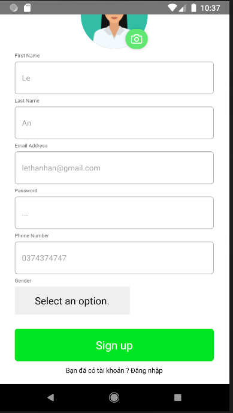
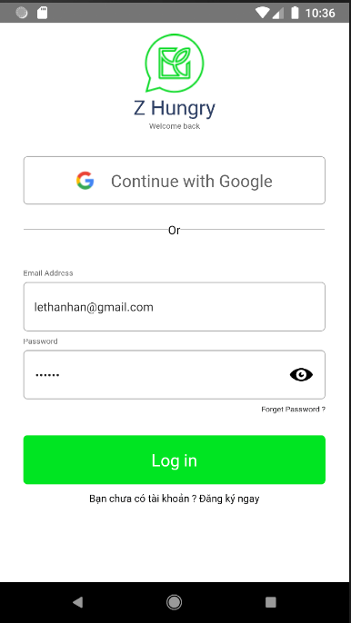
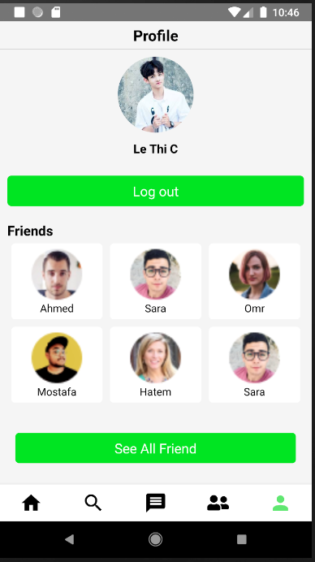
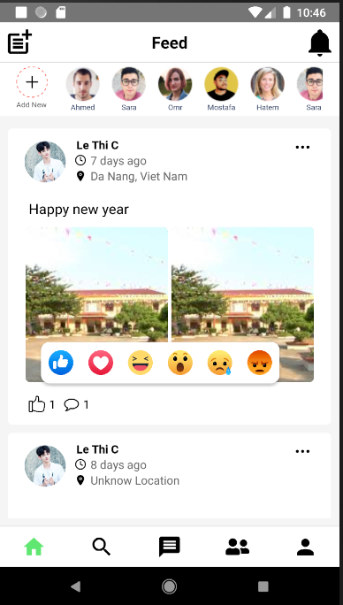
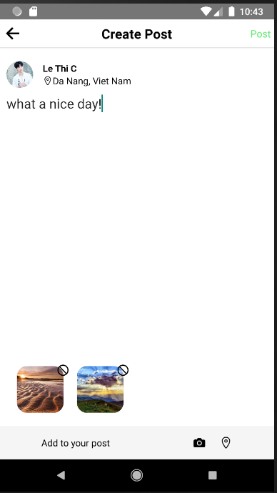
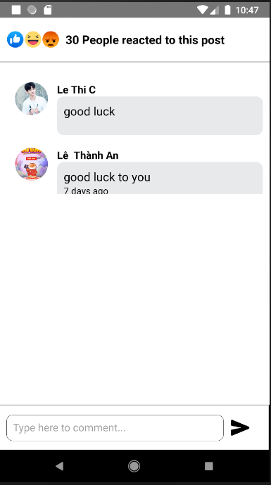
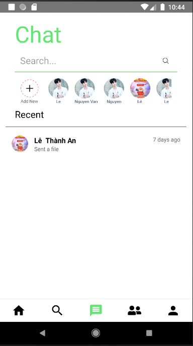
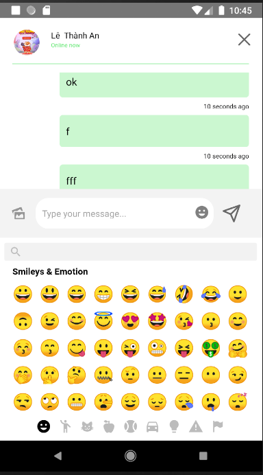
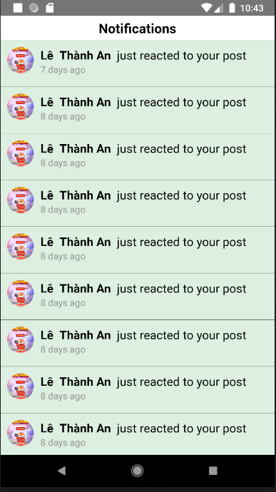
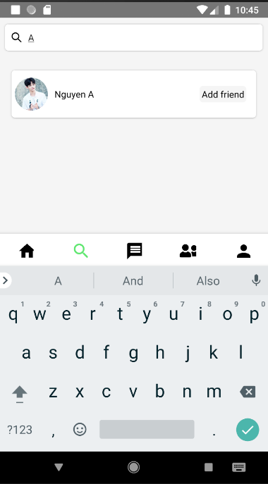

# Introduction

This project build in order to create a social network mobile application similar to Facebook

# Technologies and Database

- React Native
- Firebase Realtime Database

# Features

- Account : SignUp, Login, Profile
- Chat : Private Chat
- Post : Create Post, Post Reaction, Post Comment
- Notification
- Search

# Demo

    <h4 align="center">Signup Screen &nbsp&nbsp&nbsp&nbsp | &nbsp&nbsp&nbsp&nbsp Login Screen &nbsp&nbsp&nbsp&nbsp | &nbsp&nbsp&nbsp&nbsp Profile Screen</h4>
    
    
    

    <h4 align="center">Post Screen &nbsp&nbsp&nbsp&nbsp | &nbsp&nbsp&nbsp&nbsp Create Post Screen &nbsp&nbsp&nbsp&nbsp | &nbsp&nbsp&nbsp&nbsp Comment Post Screen</h4>
    
    
    

<h4 align="center">Private Chat List Screen &nbsp&nbsp&nbsp&nbsp | &nbsp&nbsp&nbsp&nbsp Private Chat Screen &nbsp&nbsp&nbsp&nbsp| &nbsp&nbsp&nbsp&nbsp Notification Screen &nbsp&nbsp&nbsp&nbsp</h4>
    
    
    

    <h4 align="center">Search Screen &nbsp&nbsp&nbsp&nbsp</h4>
    

# How to run
